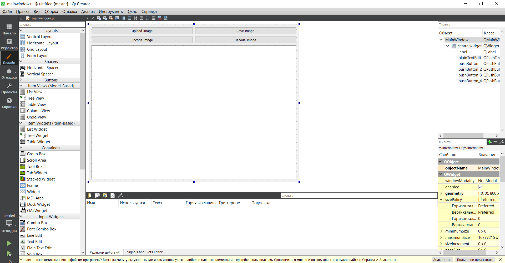
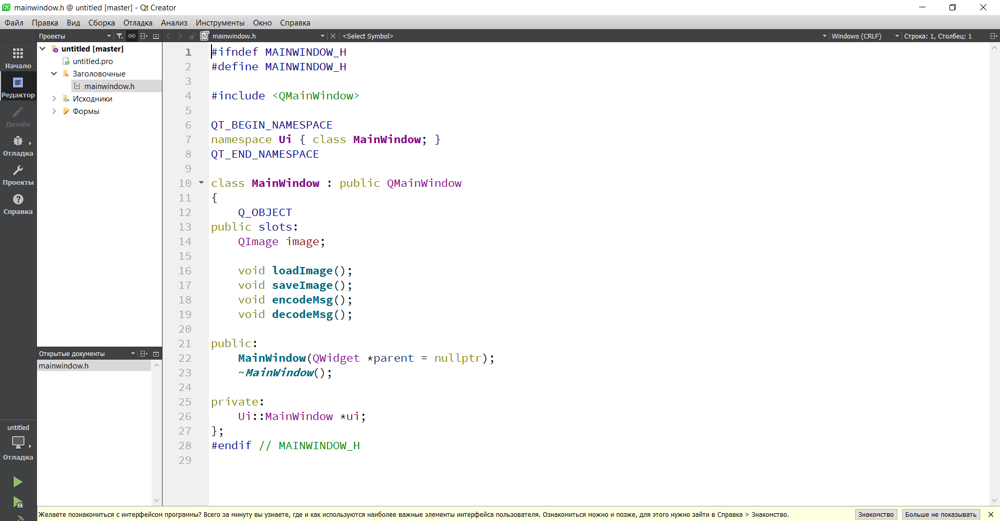

<p align="center">МИНИСТЕРСТВО НАУКИ  И ВЫСШЕГО ОБРАЗОВАНИЯ РОССИЙСКОЙ ФЕДЕРАЦИИ<br>
Федеральное государственное автономное образовательное учреждение высшего образования<br>
"КРЫМСКИЙ ФЕДЕРАЛЬНЫЙ УНИВЕРСИТЕТ им. В. И. ВЕРНАДСКОГО"<br>
ФИЗИКО-ТЕХНИЧЕСКИЙ ИНСТИТУТ<br>
Кафедра компьютерной инженерии и моделирования</p>
<br>
<h3 align="center">Отчёт по лабораторной работе № 5<br> по дисциплине "Программирование"</h3>
<br><br>
<p>студента 1 курса группы ИВТ-б-о-202(2)<br>
Рожнова Александра Вячеславовича<br>
направления подготовки 09.03.01 "Информатика и вычислительная техника"</p>
<br><br>
<table>
<tr><td>Научный руководитель<br> старший преподаватель кафедры<br> компьютерной инженерии и моделирования</td>
<td>(оценка)</td>
<td>Чабанов В.В.</td>
</tr>
</table>
<br><br>
<p align="center">Симферополь, 2020</p>
<hr>

<h2 align="left">Постнановка задачи<br><h2>

</h3>
<p align="left">Разобрать работу со средой Qt Creator для разработки приложений при помощи QTDesigner.<br>
<p align="left">Создать приложение на основе полученных знаний<br>
<p align="left">Создать и протестировать приложение для обработки функций среды.<br>
<h2 align="left">Ход работы</h2>
<h1 align="center">Пункт 1. Работа в QTDesigner</h1>
<p align="left">По первjve заданию ыл создан шаблон для работы приложения, в результате которой была дана возможность воссоздать его вид и настроить его соответствующий функционал.</p>




<h1 align="center">Пункт 2. Создание самого приложения на основе C++.</h1>
<p align="left">Для эттого создаем как в инструкции его фукционал и пропишем основной заголовочный файл. </p>



<p align="left">После необходимо этот код привязать к кнопкам, для тоого чтобы можно их было запустить и оттестировать приложение. </p>

```C++
#include "mainwindow.h"
#include "ui_mainwindow.h"
    #include <QFileDialog>
    #include <QImage>
    #include <QBuffer>
    #include <QImageWriter>
void MainWindow::loadImage()
{
 connect(ui->pushButton, &QPushButton::clicked, this, &MainWindow::loadImage);
 QStringList mimeTypeFilters({"image/png",  // will show "PNG image (*.png)"
                           "application/octet-stream" // will show "All files (*)"
});
QFileDialog dialog(this);
dialog.setMimeTypeFilters(mimeTypeFilters);
dialog.exec();
QImage image;
      QByteArray ba;
      QBuffer buffer(&ba);
      buffer.open(QIODevice::WriteOnly);
      image.save(&buffer, "PNG");
    image.convertTo(QImage::Format_ARGB32);
    //ui->label->setText("Image Loaded");
}

void MainWindow::saveImage()
{
   connect(ui->pushButton_2, &QPushButton::clicked, this, &MainWindow::saveImage);
   QString fileName = QFileDialog::getOpenFileName(this, tr("Open File"),
                                                   "/home",
                                                   tr("Images (*.png)"));
   QImage image;
           QByteArray ba;
           QBuffer buffer(&ba);
           buffer.open(QIODevice::WriteOnly);
           image.save(&buffer, "PNG");
}

void MainWindow::encodeMsg()
{   QString fileName = QFileDialog::getOpenFileName(this, tr("Open File"),
                                                    "/home",
                                                    tr("Images (*.png)"));
    connect(ui->pushButton_3, &QPushButton::clicked, this, &MainWindow::saveImage);
    for (int y = 0; y < image.height(); ++y) {
        QRgb *line = reinterpret_cast<QRgb*>(image.scanLine(y));
        for (int x = 0; x < image.width(); ++x) {
            QRgb &rgb = line[x];
            rgb = qRgba(qRed(rgb), qGreen(0), qBlue(rgb), qAlpha(rgb));

        }
    }
    QImage image(3, 3, QImage::Format_Indexed8);
    QRgb value;

    value = qRgb(122, 163, 39); // 0xff7aa327
    image.setColor(0, value);

    value = qRgb(237, 187, 51); // 0xffedba31
    image.setColor(1, value);

    value = qRgb(189, 149, 39); // 0xffbd9527
    image.setColor(2, value);

    image.setPixel(0, 1, 0);
    image.setPixel(1, 0, 0);
    image.setPixel(1, 1, 2);
    image.setPixel(2, 1, 1);
    QImageWriter writer;
       writer.setFormat("png");
       if (writer.supportsOption(QImageIOHandler::Description))
           qDebug() << "Png supports embedded text";
    ui->label->setText(QString("a message has added to the picture"));

}

void MainWindow::decodeMsg()
{
    connect(ui->pushButton_4, &QPushButton::clicked, this, &MainWindow::saveImage);
    ui->label->setText(QString("Присутствует сообщение длиной %1 байт").arg(size));
    QString::fromUtf8(const QByteArray& str)


}

MainWindow::MainWindow(QWidget *parent)
    : QMainWindow(parent)
    , ui(new Ui::MainWindow)
{
    ui->setupUi(this);
}

MainWindow::~MainWindow()
{
    delete ui;
}

```

<p align="left">Исходя из кода видно, что программа напиасана с использованием обучающих материалов в методичке, но нессмотря на все это написана программа самостоятельно, но недоработана, в связи с чем неисправна. </p>
<p>Все это планировалось доработать, потому как хотел написать его с первого раза без промежуточных этапов.</p>

<p align="left">Пункт 3. Создание самого приложения на основе Python. </p>
<p>Данный пункт работы был хоть и описан в методичке, но для недопущения ошибок не был описан в работе.</p>


<h2 align="center">Пункт 4. Вывод из работы.</h2>
<p align="left">За время написания работы была проведена попытка научиться работать со средой Qtcreator, для того чтобы можно было рабзраббатывать приложения на основе QTDesigner. Были выполнены не все пункты работы, но важные его аспекты как написание кода и демонстрация понимания работыы в QTDesigner в наличии. </p>

